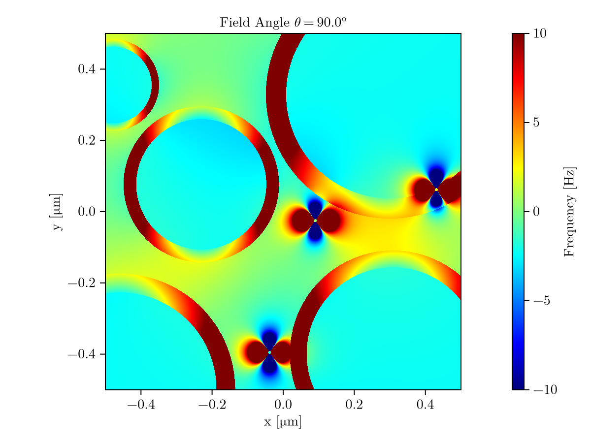
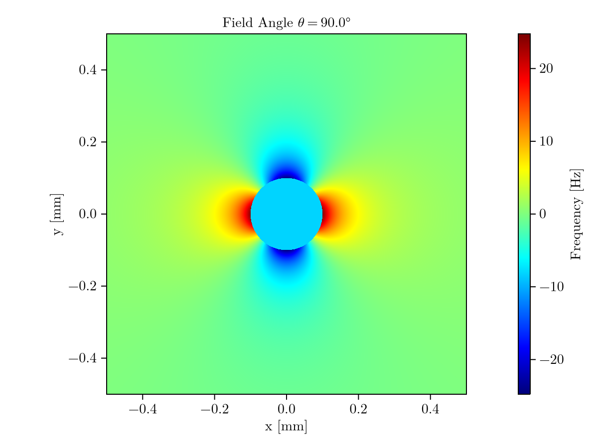

# simulatedfields

Example code to simulate magnetic field perturbations generated by structures within a constant external magnetic field.

Currently supported structures:
- Cylindrical vessels (infinite cylinders)
- Myelinated axons (concentric infinite cylinders)
- Ferritin (solid sphere)

## Examples

See `examples/examples.jl`.

```julia
julia> Random.seed!(3)
julia> myelin_plot(; width = 1.0, theta = 90.0, nmyelin = 5, nferritin = 3, save = false)
```



```julia
julia> vessel_plot(; width = 1.0, theta = 90.0, radius = 0.1, save = false)
```



## References

1. Kor D, Birkl C, Ropele S, Doucette J, et al. The role of iron and myelin in orientation dependent R2* of white matter. NMR in Biomedicine 2019; 32: e4092.
2. Wharton S, Bowtell R. Fiber orientation-dependent white matter contrast in gradient echo MRI. Proc Natl Acad Sci U S A 2012; 109: 18559–18564.
3. Xu T, Foxley S, Kleinnijenhuis M, et al. The effect of realistic geometries on the susceptibility-weighted MR signal in white matter. Magnetic Resonance in Medicine 2018; 79: 489–500.
4. Harrison PM, Arosio P. The ferritins: molecular properties, iron storage function and cellular regulation. Biochimica et Biophysica Acta (BBA) - Bioenergetics 1996; 1275: 161–203.
5. Schenck JF. Magnetic resonance imaging of brain iron. Journal of the Neurological Sciences 2003; 207: 99–102.
6. Deistung A, Rauscher A, Sedlacik J, et al. Susceptibility weighted imaging at ultra high magnetic field strengths: Theoretical considerations and experimental results. Magn Reson Med 2008; 60: 1155–1168.
7. Cheng Y-CN, Neelavalli J, Haacke EM. Limitations of Calculating Field Distributions and Magnetic Susceptibilities in MRI using a Fourier Based Method. Phys Med Biol 2009; 54: 1169–1189.
