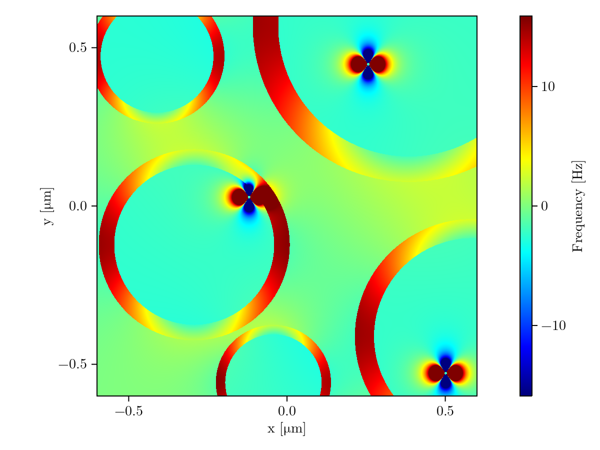

# myelinfields

Example code to simulate magnetic field perturbations generated by myelinated axons and ferritin in a constant magnetic field.

# References

1. Kor D, Birkl C, Ropele S, Doucette J, et al. The role of iron and myelin in orientation dependent R2* of white matter. NMR in Biomedicine 2019; 32: e4092.
2. Wharton S, Bowtell R. Fiber orientation-dependent white matter contrast in gradient echo MRI. Proc Natl Acad Sci U S A 2012; 109: 18559–18564.
3. Xu T, Foxley S, Kleinnijenhuis M, et al. The effect of realistic geometries on the susceptibility-weighted MR signal in white matter. Magnetic Resonance in Medicine 2018; 79: 489–500.
4. Harrison PM, Arosio P. The ferritins: molecular properties, iron storage function and cellular regulation. Biochimica et Biophysica Acta (BBA) - Bioenergetics 1996; 1275: 161–203.
5. Schenck JF. Magnetic resonance imaging of brain iron. Journal of the Neurological Sciences 2003; 207: 99–102.
